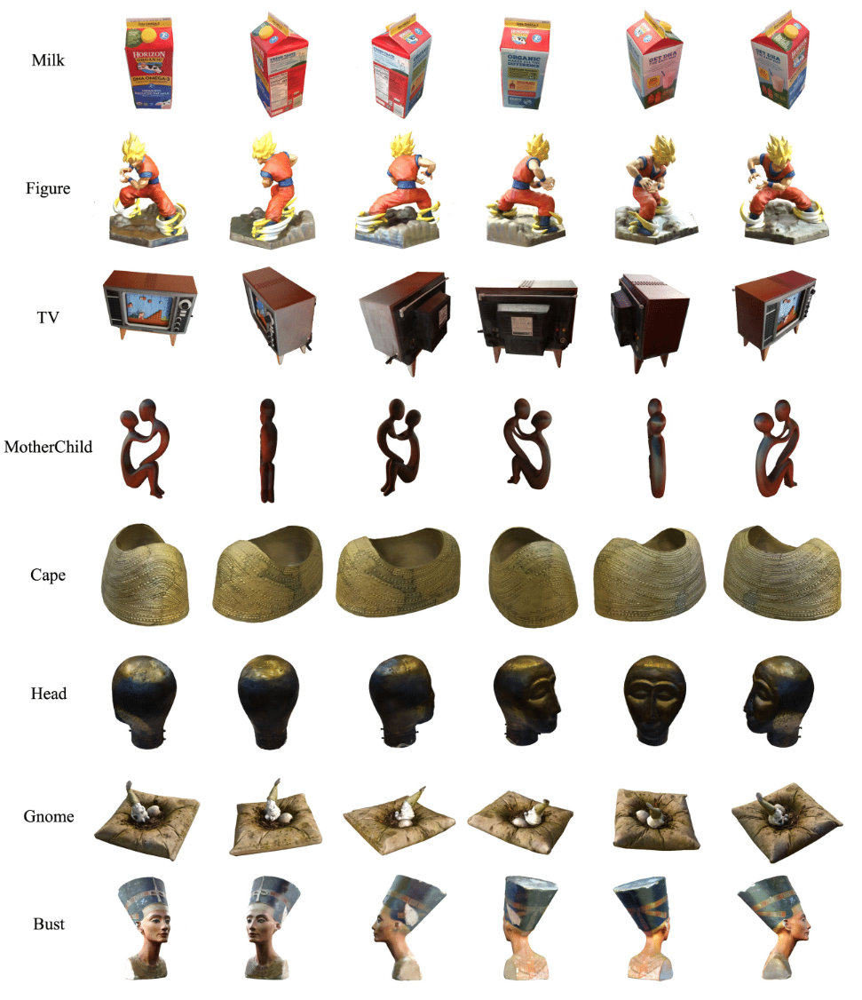
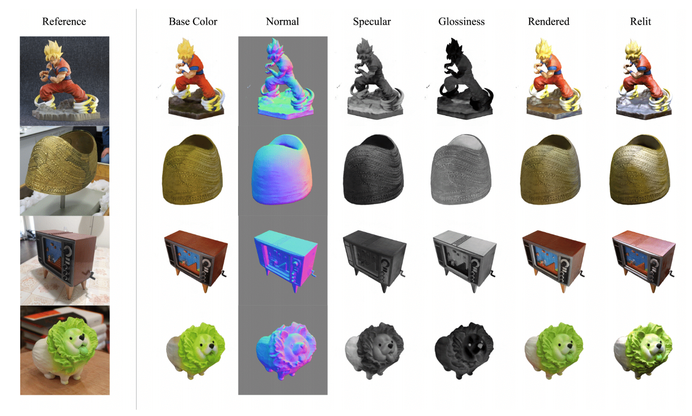

# NeROIC: Neural Object Capture and Rendering from Online Image Collections

This repository is for the source code for the paper [NeROIC: Neural Object Capture and Rendering from Online Image Collections](https://arxiv.org/abs/2201.02533) by [Zhengfei Kuang](https://zhengfeikuang.com), [Kyle Olszewski](https://kyleolsz.github.io/), [Menglei Chai](https://mlchai.com/), [Zeng Huang](https://zeng.science/), [Panos Achlioptas](https://optas.github.io/), and [Sergey Tulyakov](http://stulyakov.com).

The code is coming soon. For more information, please check out the project [website](https://formyfamily.github.io/NeROIC/).

## Overview

Our two-stage model takes images of an object from different conditions as input. 
With the camera poses of images and object foreground masks acquired by other state-of-the-art methods, 
We first optimize the geometry of scanned object and refine camera poses by training a NeRF-based network; 
We then compute the surface normal from the geometry (represented by density function) using our normal extraction layer;
Finally, our second stage model decomposes the material properties of the object and solves for the lighting conditions for each image. 


## Novel View Synthesis

Given online images from a common object, our model can synthesize novel views of the object with the lighting conditions from the training images.

https://user-images.githubusercontent.com/8952528/148708746-14c2db49-2516-4e31-a1be-559be4480b01.mp4



## Material Decomposition

https://user-images.githubusercontent.com/8952528/148708751-7fb1c820-57d3-454f-a411-635c141fab18.mp4



## Relighting

https://user-images.githubusercontent.com/8952528/148708757-f7c981f0-3963-49cb-a492-4fae73429105.mp4

## Citation

If you find this useful, please cite the following:
```
@article{kuang2021neroic,
  author = {Kuang, Zhengfei and Olszewski, Kyle and Chai, Menglei and Huang, Zeng and Achlioptas, Panos and Tulyakov, Sergey},
  title = {{NeROIC}: Neural Object Capture and Rendering from Online Image Collections},
  journal = Computing Research Repository (CoRR),
  volume = {abs/2201.02533},
  year = {2022}
}
